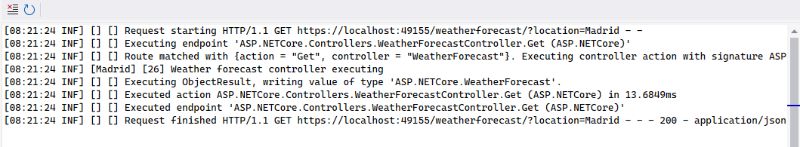
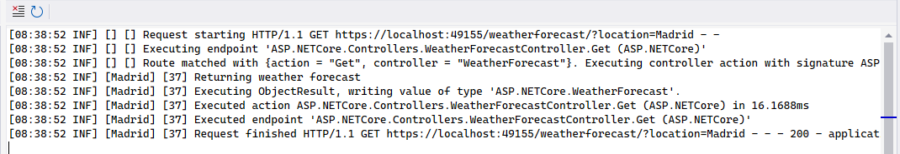
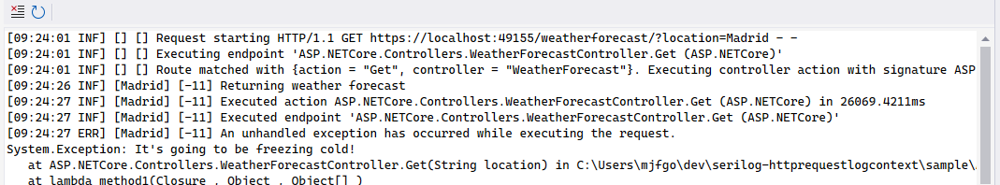

# Serilog.Enrichers.HttpRequestLogContext

[](https://github.com/MonticolaExplorator/serilog-httprequestlogcontext/actions/workflows/build-and-test.yml) [](https://github.com/MonticolaExplorator/serilog-httprequestlogcontext/actions/workflows/release.yml)

A [Serilog](https://serilog.net/) enricher to add properties to your log events scoped to a [ASP.NET Core HttpRequest](https://learn.microsoft.com/en-us/dotnet/api/microsoft.aspnetcore.http.httprequest). 

## Getting started

Add the Serilog namespace to your startup or program C# file:

```csharp
using Serilog;
```

Include the Http request log context enricher in your logger configuration:

```csharp
builder.Host.UseSerilog((ctx, cfg) =>
    cfg.Enrich.FromHttpRequestLogContext()
    //rest of the configuration...
```

The `FromHttpRequestLogContext()` enricher adds the properties present on the `Serilog.Context.HttpRequestLogContext`, to all log events produced in the scope of an Http request.

The properties can be added and removed from the Http request log context using `HttpRequestLogContext.PushProperty`:

```csharp
HttpRequestLogContext.PushProperty("User", "Jonh_Doe");
HttpRequestLogContext.PushProperty("APIVersion", "1.0.1.239");
```

After the above code is executed, any log event written to any Serilog sink on the scope of the current Http request contain the properties `User` and `APIVersion` automatically. 

### Removing properties

The `Serilog.Context.HttpRequestLogContext` is automatically cleared when the current Http request ends. However, properties can also be removed manually from the context by disposing the object returned by 
the `HttpRequestLogContext.PushProperty` method:

```csharp
HttpRequestLogContext.PushProperty("A", 1);

Log.Information("Carries property A = 1");

using (HttpRequestLogContext.PushProperty("A", 2))
using (HttpRequestLogContext.PushProperty("B", 1))
{
    Log.Information("Carries A = 2 and B = 1");
}

Log.Information("Carries property A = 1, again");
```

Pushing a property onto the `Serilog.Context.HttpRequestLogContext` will override any existing properties with the same name, until the object returned from `PushProperty()` is disposed, as the property `A` in the example demonstrates.

**Important:** popping a property also pops all the properties pushed to the http context on top of it, as the next example demonstrates.

```csharp


Log.Information("Carries no properties");

using (HttpRequestLogContext.PushProperty("A", 1))
{
    HttpRequestLogContext.PushProperty("B", 1);
    Log.Information("Carries A = 1 and B = 1");
}

Log.Information("Carries no properties, again");
```

### Use case

When using Serilog on an ASP.NET Core project, it is very common to enrich the log on the controller methods, using the `Serilog.Context.LogContext`. The problem here is that the properties added to the context will be scoped to the controller method only, and many log event on the current Http request will miss those properties.

```csharp
builder.Host.UseSerilog((ctx, cfg) =>
    cfg.Enrich.FromLogContext()
    .WriteTo.Console(outputTemplate: "[{Timestamp:HH:mm:ss} {Level:u3}] [{$Location}] [{$PredictedTemp}] {Message:lj} {NewLine}{Exception}"));

[HttpGet]
public WeatherForecast Get(string location)
{
    var forecast = new WeatherForecast
    {
        Date = DateTime.Now.AddDays(1),
        TemperatureC = Random.Shared.Next(-20, 55),
        Summary = Summaries[Random.Shared.Next(Summaries.Length)]
    };
    using (LogContext.PushProperty("Location", location))
    using (LogContext.PushProperty("PredictedTemp", forecast.TemperatureC))
    {
        _logger.LogInformation("Weather forecast controller executing");

        if (forecast.TemperatureC < -10)
            throw new Exception("It's going to be freezing cold!");

        return forecast;
    }
}
```



It can be seen on the example above that ASP.NET Core logs many useful information, and these events are missing the the properties that are pushed on the controller. By using the `Serilog.Context.HttpRequestLogContext` we can fix this issue easily.


```csharp
builder.Host.UseSerilog((ctx, cfg) =>
    cfg.Enrich.FromHttpRequestLogContext()
    .WriteTo.Console(outputTemplate: "[{Timestamp:HH:mm:ss} {Level:u3}] [{$Location}] [{$PredictedTemp}] {Message:lj} {NewLine}{Exception}"));

[HttpGet]
public WeatherForecast Get(string location)
{
    var forecast = new WeatherForecast
    {
        Date = DateTime.Now.AddDays(1),
        TemperatureC = Random.Shared.Next(-20, 55),
        Summary = Summaries[Random.Shared.Next(Summaries.Length)]
    };
    HttpRequestLogContext.PushProperty("Location", location);
    HttpRequestLogContext.PushProperty("PredictedTemp", forecast.TemperatureC);

    _logger.LogInformation("Returning weather forecast");

    if (forecast.TemperatureC < -10)
        throw new Exception("It's going to be freezing cold!");

    return forecast;
}
```



All the events logged after the execution reaches the controller now include the properties that are pushed on the controller. These allows to easily inject our properties on the events that log the time that the request took, the http status code returned. In case there is any exception processing the Http request, the log will include the pushed properties as well.



